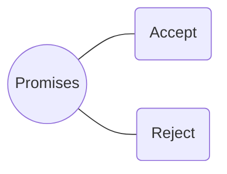
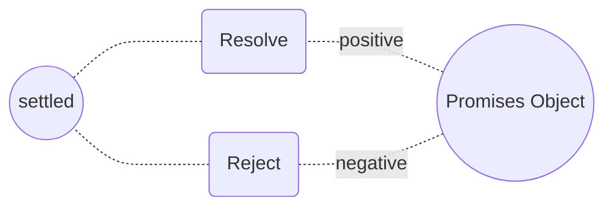

# JavaScript
### Advance Concepts 

1. Promises

Promise always about future

```mermaid
flowchart LR
    A((Promises)) 

    A---B(Accept)
    A---C(Reject)

```

```mermaid
flowchart RL
    A((Promises Object)) 

    A-. positive .-B(Resolve)
    A-. negative.-C(Reject)

    B-..-BA((settled))
    C-..-BA((settled))

```

2. Async, Await
3. Error Handling