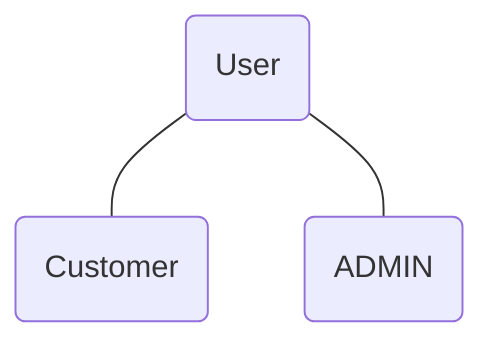

# ECommerceProject
- REST APIs
- Authentication and Authorization


### Authentication and Authorization
#### Authentication
 - Who I am? 

#### Authorization
 - What I can do?

### APIs
 - No security

#### Access Token
1. Register
1. Login
1. Get Access Token
1. Token have expire time

### Token Based Authentication
1. OTP

#### MFA(Multi-Factor Auth)
1. Username / Password
1. OTP

## Project Setup
1. Create Nodejs Project
    - npm init
1. Define the structure of the project
    - Router
       - Router is like a receptionist
    - Controller
       - Router is like a waiter
    - Model
       - Router is like a chef
1. Auth
    ```mermaid
     flowchart
     A((User))---B((Customer))
     A---C((ADMIN))
     D(1.Registration)---E
     E(2.Login)---F(Excess Token)
    ```
1. Dependency
    1. MongoDB(Mongoose)
    1. ExpressJS
    1. JWT(Json Web Token)
    1. Bcryptjs

### Commands
 1. npm install bcryptjs
 1. npm install express 
 1. npm install jsonwebtoken
 1. npm install mongoose