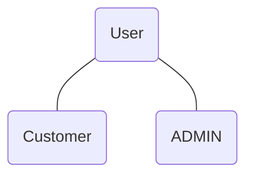

# ECommerceProject
- REST APIs
- Authentication and Authorization


### Authentication and Authorization
#### Authentication
 - Who I am? 

#### Authorization
 - What I can do?

### APIs
 - No security

#### Access Token
1. Register
1. Login
1. Get Access Token
1. Token have expire time

### Token Based Authentication
1. OTP

#### MFA(Multi-Factor Auth)
1. Username / Password
1. OTP

## Project Setup
1. Create Nodejs Project
    - npm init
1. Define the structure of the project
    - Router
       - Router is like a receptionist
    - Controller
       - Router is like a waiter
    - Model
       - Router is like a chef
1. Auth
    ```mermaid
     flowchart
     A((User))---B((Customer))
     A---C((ADMIN))
     D(1.Registration)---E
     E(2.Login)---F(Excess Token)
    ```
1. Dependency
    1. MongoDB(Mongoose)
    1. ExpressJS
    1. JWT(Json Web Token)
    1. Bcryptjs

### Commands
 1. npm install bcryptjs
 1. npm install express 
 1. npm install jsonwebtoken
 1. npm install mongoose

 ### Work on a project
 1. Models
 1. Controllers
 1. Routes 

#### Creation
 Creation of costumer should made with APIs
 and admin creation internally

## Database
<pre>

    test> show dbs;
    admin       40.00 KiB
    be_demodb  112.00 KiB
    config      72.00 KiB
    ecomm_db    80.00 KiB
    local       40.00 KiB
    newdb       72.00 KiB
    test> use ecomm_db;
    switched to db ecomm_db
    ecomm_db> show collections;
    users
    ecomm_db> db.users.find()
    [
    {
        _id: ObjectId('65ddaab4478ce043e2ea47d7'),
        name: 'Nabin',
        userId: 'admin',
        password: '$2a$08$RWqfqoMypGAk5JD6uqESFefbqD54HbpuQB5i1AlwfrenrfNIi1yLO',
        email: 'nabin@gmail.com',
        userType: 'ADMIN',
        createdAt: ISODate('2024-02-27T09:26:12.528Z'),
        updatedAt: ISODate('2024-02-27T09:26:12.528Z')
    }
    ]

</pre>

## POSTMAN
 - Postman is a google extension

## Before Break
1. Project structure
1. Model user model
1. created admin user
1. create the api for user registration